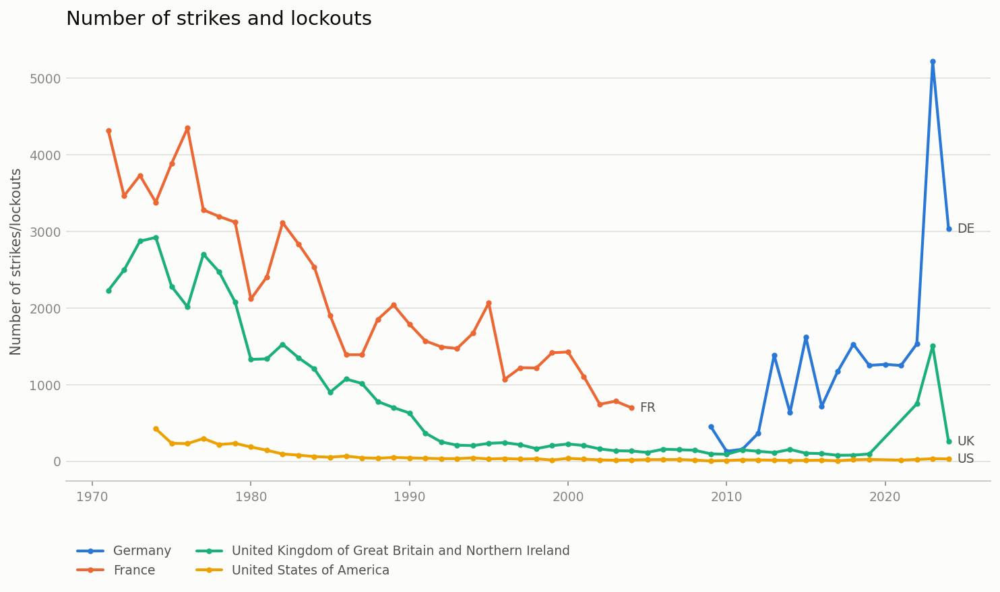
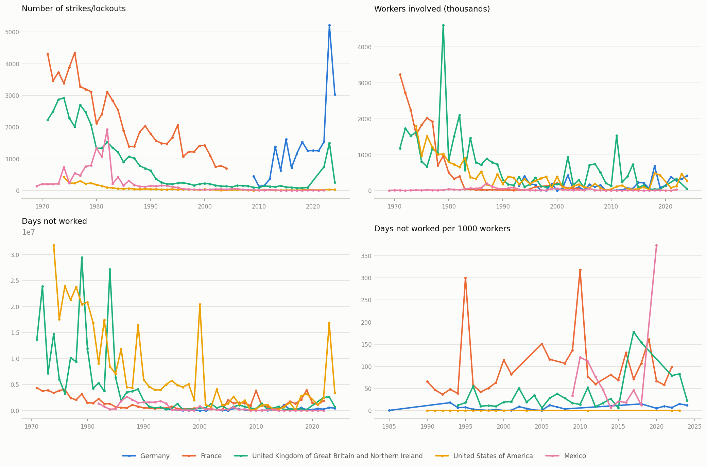

# ILOSTAT Industrial Disputes — Results

Auto-generated by `generate_report.py` from `processed/industrial_disputes_panel.csv`. Do not edit by hand — re-run the script after the data changes.

**Coverage**: 3,501 country-year rows, 127 countries/territories, 1969–2024.

## Summary statistics

| Variable | N | Missing | Mean | SD | Min | Median | Max |
|---|---|---|---|---|---|---|---|
| Number of strikes/lockouts | 3360 | 141 | 274.98 | 769.90 | 0.00 | 36.00 | 17,007.00 |
| Workers involved (thousands) | 3235 | 266 | 1,217.48 | 27,525.30 | 0.00 | 15.99 | 1,284,678.00 |
| Days not worked | 3188 | 313 | 1,926,156.31 | 12,671,546.40 | 0.00 | 66,488.00 | 340,954,860.00 |
| Days not worked per 1000 workers | 929 | 2572 | 270.32 | 4,703.96 | 0.00 | 11.00 | 140,530.00 |

## Correlations

Pairwise correlations (pairwise-complete observations).

|  | n_strikes | workers_inv | days_notwkd | days_rate |
|---|---|---|---|---|
| n_strikes | 1.00 | 0.08 | 0.15 | -0.01 |
| workers_inv | 0.08 | 1.00 | 0.01 | -0.00 |
| days_notwkd | 0.15 | 0.01 | 1.00 | 0.01 |
| days_rate | -0.01 | -0.00 | 0.01 | 1.00 |

## Biggest recorded disputes

### By number of strikes/lockouts

| Country | Year | Number of strikes/lockouts |
|---|---|---|
| Russian Federation | 1997 | 17,007 |
| Poland | 2008 | 12,765 |
| Russian Federation | 1998 | 11,162 |
| Russian Federation | 1995 | 8,856 |
| Russian Federation | 1996 | 8,278 |
| Poland | 1993 | 7,443 |
| Russian Federation | 1999 | 7,285 |
| Poland | 1992 | 6,351 |
| Russian Federation | 1992 | 6,273 |
| Russian Federation | 2004 | 5,933 |

### By days not worked

| Country | Year | Days not worked |
|---|---|---|
| Brazil | 2003 | 340,954,860 |
| Brazil | 2000 | 238,921,522 |
| Brazil | 2007 | 237,156,516 |
| Nigeria | 1994 | 233,684,771 |
| Brazil | 2005 | 230,604,495 |
| Brazil | 2006 | 183,776,042 |
| Brazil | 2004 | 150,484,289 |
| Brazil | 2008 | 143,432,937 |
| Brazil | 1989 | 117,792,000 |
| Brazil | 2002 | 116,620,512 |

## Time series

